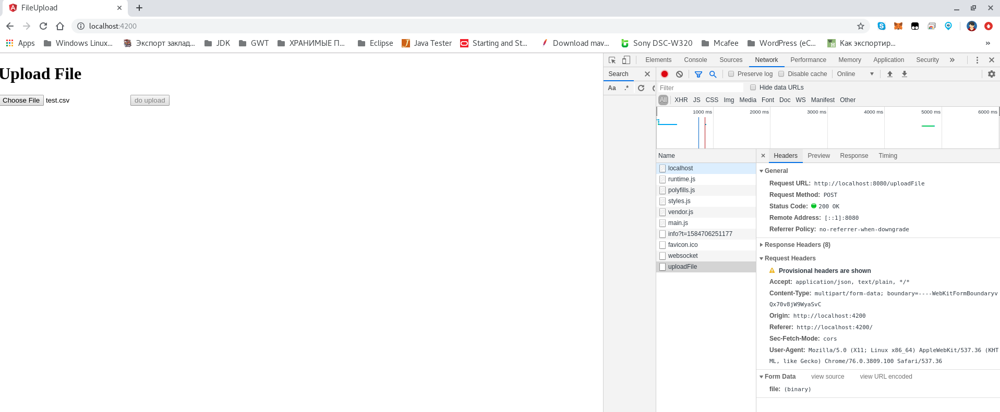
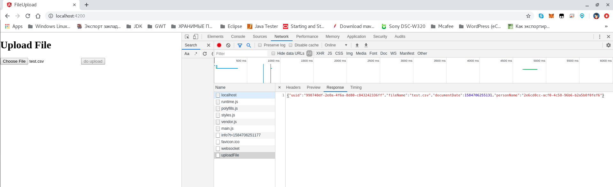
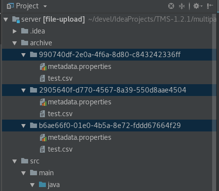

# File Upload & Download as Multipart File using Angular + Spring Boot

This project was generated with [Angular CLI](https://github.com/angular/angular-cli) version 8.1.1.

* Tutorial: [Upload and View Files in Amazon S3 using Angular + Spring Boot](http://chinthakajayatilake.tech/)
* https://medium.com/@chinthakajayatilake98/file-upload-download-as-multipart-file-using-angular-6-spring-boot-7ad06d841c21
* Repo: [AWS-S3-FileManagement](https://github.com/ChinthakaJ98/AWS-S3-FileManagement) **(** [File-Upload-Download](https://github.com/ChinthakaJ98/File-Upload-Download) **)**
* **(** [How To Upload a File With Angular 6/7 Tutorial](https://www.ninjadevcorner.com/2019/01/how-to-upload-file-with-angular-6-7-tutorial.html) **)**

## Development server

Run `ng serve` for a dev server. Navigate to `http://localhost:4200/`. The app will automatically reload if you change any of the source files.

* [Angular 9/8 Tutorial & Example — Upload Files with FormData, HttpClient, RxJS, and Material ProgressBar](https://www.ahmedbouchefra.com/angular/angular-9-8-tutorial-example-upload-files-with-formdata-httpclient-rxjs-and-material-progressbar/)
* https://long2know.com/2017/03/angular-file-upload-to-webapi/
* https://stackoverflow.com/questions/47936183/angular-file-upload